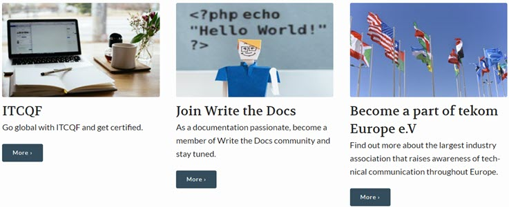

#### What does this guide consist of?

This guide consists of:

* navigator:

1. **Home** page
2. **Getting started** section where you can find out how to make the use of this guide
3. **Explore Poland** section where you can find all information related to the tech comm in Poland and the Polish job market
4. **Community building** guidelines
5. **FAQ** section where you will find answers to all common doubts

* the part where you can investigate tech comm worldwide

* the link to an online meeting with a co-founder of tech comm in Poland:

#### How to navigate through this guide?

To systematize your knowledge, it is best to start either with **Explore Poland** section or the online meeting to find out what your Polish colleagues have done to make the community visible. Learn about tech comm training and find out more about the industry events.

Then, you can read the community building guidelines which cover all information on what to start with and how to keep going. 

Finally, check the **FAQ** section for answers to your doubts.

