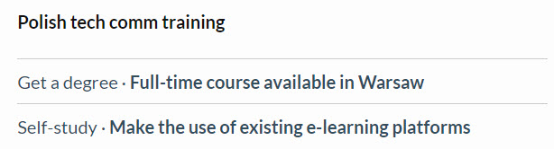

#### What does this guide consist of?

This guide consists of:

* main menu:

1. **Home** page
2. **Getting started** section where you can find out how to make the use of this guide
3. **Explore** section where you can find information about the tech comm in Poland and the Polish job market
4. **FAQ** section where you will find answers to all common doubts

* a roadmap where you can discover how-to approach more deeply:

* the link to an online meeting with a co-founder of tech comm in Poland:

* the tech comm training and workshops section, which provides an insight into industry education in Poland:

#### How to navigate through this guide?

To systematize your knowledge, it is best to start either with **Explore** section or an online meeting to find out what your Polish colleagues have done to make the community visible. Learn about tech comm training and find out more about the industry events.

Then, you can read the community building guidelines which cover all information on what to start with and how to keep going. 

Finally, check the **FAQ** section for answers to your doubts.

